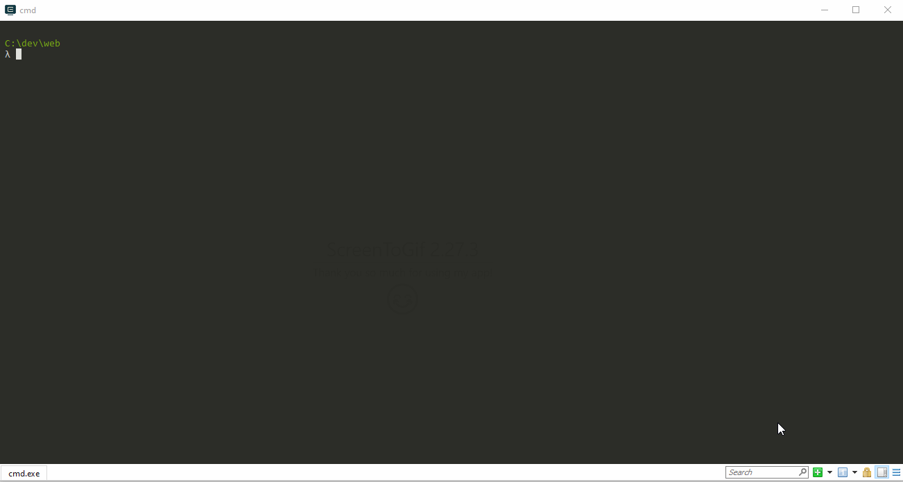

# TTI

Table-Top Infrastructure for the [H2020 STRATEGY project](https://strategy-project.eu/), which is based on the [KP7 DRIVER+](https://www.driver-project.eu) infrastructure. To read more about the developement results, click [here](https://github.com/DRIVER-EU), or browse a list of dissemination results [here](https://github.com/DRIVER-EU/dissemination). In particular, the [animation](https://github.com/DRIVER-EU/dissemination/blob/master/animations/20190929_Animatie%20Driver_BASIC%20SUBS_Elke%20Uijtewaal_DEF.mp4) and the [Test-bed design specification v3](https://github.com/DRIVER-EU/dissemination/blob/master/specifications/DRIVER%2B_D923.23_Reference%20implementation%20v3%20-%20Final%20release%20of%20the%20test-bed%20reference%20implementation.pdf).


## Explanation

To run a technology-supported trial, exercise, training or table top, the EU-funded DRIVER+ project has developed a complete setup. Within the EU-funded H2020 STRATEGY project, this infrastructure is further refined and adapted to support the 7 tabletops and the final exercise. It consists of:

- Middleware, so different solutions/applications can exchange information with each other, receive (simulation) time information, and can exchange large files.
- The Trial Management Tool (TMT), a scenario editor to inject messages/events into the middleware, triggering actions in role players, end-user applications or attached simulators.
- Mail service, for exchanging messages between participants, and with the TMT.

## Installation

All services are running in Docker containers, so you need to have Docker running on your system. In the `docker` folder, several TTI configurations can be found, including specific instructions. To start up all services, do:

```bash
git clone https://github.com/STRATEGY-EU/TTI.git
cd TTI/docker/local
docker-compose pull
docker-compose up -d
```

And a home page should be available at [localhost](http://localhost).

Or watch the instructions:



To show the status of all services, you can, for example, use `dockly` (you need to have [node.js](https://nodejs.org) installed), which you can install using `npm i -g dockly` (on Linux, this may require `sudo` privileges). Alternatively, you can simply do `docker ps`.

A typical approach to connect your system to the TTI is as follows:

1. Run [TTI](https://github.com/STRATEGY-EU/TTI/tree/main/docker/local-c2) locally
2. Choose an [adapter](https://github.com/DRIVER-EU) and integrate it in your system
3. Connect to the local TTI (configuring the adapter)
4. Create a new [AVRO message schema](https://toolslick.com/generation/metadata/avro-schema-from-json) or select an [existing schema](https://github.com/STRATEGY-EU/TTI/tree/main/docker/local-c2/schemas).
5. Name the schema (`my_name-value.avsc`) and add it to the schemas folder of the TTI.
6. Restart the TTI (`docker-compose up -d`) so the bootstrapper will register the new schema.
7. Check if the schema has been registered using the [Kafka schema UI](http://localhost:3601).
8. Send a message to the new topic (`my_name`, exclude `-value`).
9. Check if the message has been received using the [Kafka topics UI](http://localhost:3600).1. Run [TTI](https://github.com/STRATEGY-EU/TTI/tree/main/docker/local-c2) locally
10. To receive messages, check that the schema is available and subscribe to the topic.
11. Use the TMT to create messages and send them to the TTI (check as in 9).
12. Your adapter should receive these messages too, and you can handle them appropriately.

NOTE: Each adapter exposes the simulation time. Please use that simulation time as the actual time if your application displays time, or sends messages to others.

## Using the mail service

For detailed information, see [here](https://github.com/DRIVER-EU/email-gateway). First use the mail API to create a mail account, e.g. `test@strategy.eu`. Next, you can use that account to login via the Webmail UI (with the password 'default'). Alternatively, you can create mail accounts automatically by sending a `simulation_entity_post` message.
